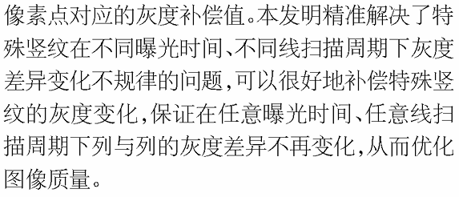
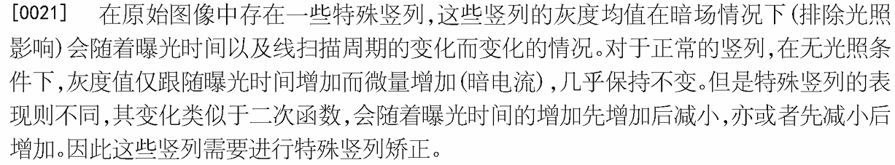

埃科2025年获得了新的专利授权[一种图像像素点异常去除方法,系统及介质](https://www.patentguru.com/cn/search?q=%E4%B8%80%E7%A7%8D%E5%9B%BE%E5%83%8F%E5%83%8F%E7%B4%A0%E7%82%B9%E5%BC%82%E5%B8%B8%E5%8E%BB%E9%99%A4%E6%96%B9%E6%B3%95%E3%80%81%E7%B3%BB%E7%BB%9F%E5%8F%8A%E4%BB%8B%E8%B4%A8)，提到了Sensor中有些异常点亮度的变化是非线性的，所以需要用多段曝光方式来标定这些异常点。

### 🔍 一、**异常点非线性响应的核心物理成因**

#### 1. **暗电流非均匀性（Dark Current Non-Uniformity）**

- **机制**：  
    传感器像素单元中的硅衬底存在晶格缺陷或金属杂质（如铜、铁离子），形成电荷“陷阱”。这些陷阱在长曝光时持续捕获热生电子，导致暗电流随曝光时间**指数级增长**（非线性）。
    
- **影响**：  
    异常像素在低照度长曝光下亮度异常升高，且增长曲线偏离线性模型（如短曝光正常，长曝光突然出现亮斑）。
    

#### 2. **光电二极管泄漏电流（Photo-Diode Leakage）**

- **机制**：  
    像素光电二极管的耗尽区边缘存在电场畸变（由掺杂不均匀导致），引发隧道效应或热载流子注入。泄漏电流随电压/温度非线性变化，曝光时间延长时异常点亮度呈**分段跳跃式上升**。
    
- **典型场景**：  
    高温环境下（如工业相机长时间运行），异常点亮度变化率显著高于正常像素。
    

#### 3. **复位晶体管阈值电压漂移（Reset Transistor Vth Shift）**

- **机制**：  
    复位晶体管的栅氧层经长期电应力后产生电荷 trapping，导致阈值电压（Vth）漂移。这使得复位电平随使用时长累积性偏移，表现为：
    
    - 短曝光：复位电平偏差小，影响微弱；
        
    - 长曝光：复位误差被放大，异常点输出非线性衰减（如亮度低于邻域）。
        
- **专利关联**：  
    埃科的多段曝光标定可针对不同曝光时长动态修正Vth漂移导致的灰度偏差。
    

#### 4. **微透镜与滤光片工艺缺陷**

- **机制**：
    
    - **微透镜偏移**：异常像素的微透镜与光电二极管错位，短曝光时进光量不足，长曝光时光子散射效应增强，亮度非线性补偿；
        
    - **滤光片厚度不均**：导致特定波长透光率异常，在宽光谱光源下呈现曝光相关的色偏。