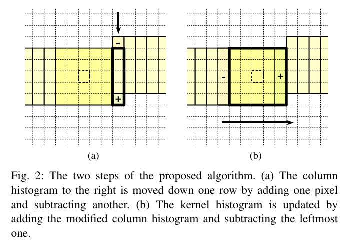
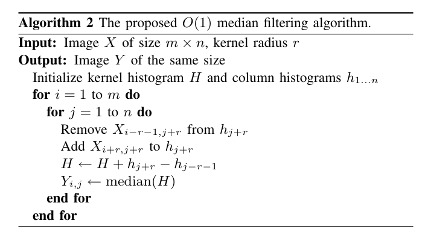

这个代码基于 [astrometry.net/util/ctmf.c at main · dstndstn/astrometry.net](https://github.com/dstndstn/astrometry.net/blob/main/util/ctmf.c) 改的，原算法是Median Filtering in Constant Time，2007[PerreaultHebert-tip2007.pdf](http://mesh.brown.edu/ENGN1610/refs/PerreaultHebert-tip2007.pdf)的中值滤波算法。这里的修改添加了threshold参数，半径为r的局部中值与原像素点之差大于threshold就认为是坏点。cn是通道数的意思。

```
void ctmf(
        const unsigned char* const src, unsigned char* const dst,
        const int width, const int height,
        const int src_step, const int dst_step,
		const int r, const int cn, int threshold
        ) {
        ctmf_helper(src, dst, width, height, src_step, dst_step, r, cn,
	1, 1, threshold);
}

static void ctmf_helper(
        const unsigned char* const src, unsigned char* const dst,
        const int width, const int height,
        const int src_step, const int dst_step,
        const int r, const int cn,
		const int pad_left, const int pad_right, int threshold
        )
```
如下图所示算法主要是如下2步，一是从列直方图中去掉一个像素，加上下一个像素。二是从kernel直方图中去掉最左侧的列直方图，加上最右侧的列直方图。


算法对图中的每一列都维护一个直方图，这个直方图组在计算期间一直存在。通过上述的两步法就可以不断的更新kernel直方图，并获得中值滤波的结果了。
