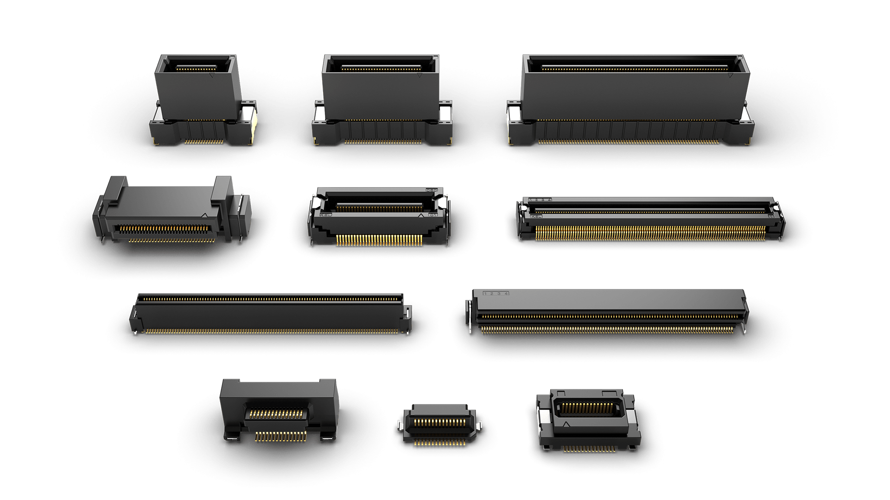
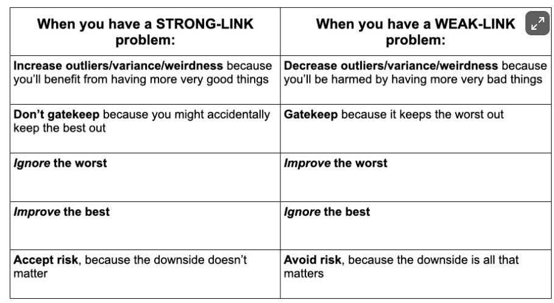

- Sony采用了一种Floating Connection的方式作为senor的接口，[Floating Connectors - Products - KEL](https://kelconnectors.com/products/floating-connectors/)，这样可以做到多款Sensor pin2pin兼容。并且通过在Sensor板上添加辅助调平定位点，可以简化Sensor调平的步骤。而且这种Floating Connection的接口形状比较规整，方便统一散热铜片的形状。好处多多。

- [Science is a strong-link problem - by Adam Mastroianni](https://www.experimental-history.com/p/science-is-a-strong-link-problem)提出了强连接问题和弱连接问题的区别。强连接问题是指系统的好坏取决于最好的样本的问题，比如音乐中最好听的部分使得其它部分无关紧要。弱连接问题刚好相反，系统的好坏取决于最坏的样本。对于强连接问题不要守门，因为有可能会把异常好的例子规避掉，忽略最差的例子，努力改进最好的例子，接受风险。对于弱连接问题要守门，关注最差的例子，忽略最好的例子，规避风险。

